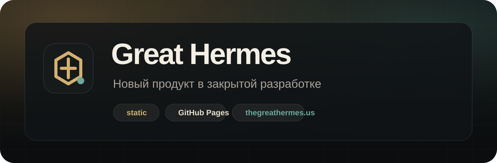

# Great Hermes Website



[](https://github.com/VovasaeXranitel/GreatHermesWebsite/actions/workflows/pages.yml)
[](https://github.com/VovasaeXranitel/GreatHermesWebsite/actions/workflows/ci.yml)
[](https://vovasaexranitel.github.io/GreatHermesWebsite/)
[](https://thegreathermes.us)

Публичный тизер Great Hermes.

## Назначение

Этот репозиторий содержит статический сайт бренда. Подробности продукта будут опубликованы после официального анонса.

## Локальный запуск

```powershell
git clone https://github.com/VovasaeXranitel/GreatHermesWebsite.git
cd GreatHermesWebsite
npm test
python -m http.server 8080
```

Открыть:

```text
http://127.0.0.1:8080
```

## Структура

```text
assets/                 Изображения для README и social preview
.github/workflows/      CI и GitHub Pages deployment
index.html              Основная страница
favicon.svg             Иконка сайта
site.webmanifest        Метаданные для браузеров
robots.txt              Правила индексации
sitemap.xml             Карта сайта
CNAME                   Пользовательский домен GitHub Pages
scripts/check-site.mjs  Smoke-проверка сайта и публичных файлов
```

## Проверки

```powershell
npm test
```

Проверяется:

- наличие обязательных файлов;
- отсутствие битой кириллицы;
- наличие SEO/Open Graph/Twitter/PWA-метаданных;
- согласованность `CNAME`, канонического адреса, sitemap и social metadata;
- отсутствие типовых секретов в публичных файлах.

## Публикация

GitHub Pages публикует сайт из ветки `main` через:

```text
.github/workflows/pages.yml
```

Адреса:

- GitHub Pages: https://vovasaexranitel.github.io/GreatHermesWebsite/
- Основной домен: https://thegreathermes.us

Основной домен подключается к GitHub Pages через `CNAME` и DNS-записи у провайдера домена.

## Правила качества

- Сайт остаётся статическим, пока нет серьёзной причины добавлять сборщик.
- Текст должен быть понятным для человека, а не похожим на машинный перевод.
- Главная страница сообщает ценность и статус, не раскрывая внутреннее устройство продукта.
- В репозиторий нельзя добавлять токены, `.env`, tunnel credentials, логи и локальные пути машины.
